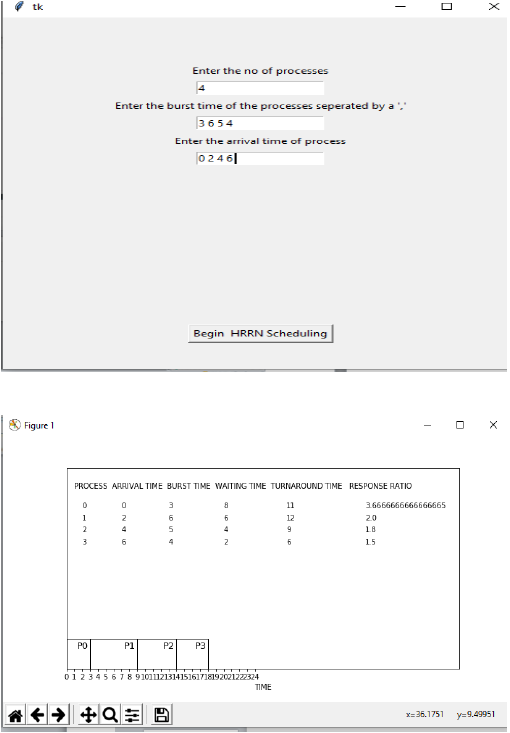

# Simulation of Multilevel Queue Scheduling and Highest Response Ratio Next Scheduling using Python

**Objective :** To simulate the multilevel queue scheduling and highest response ratio next algorithm

**Language Used :** Python

**Modules Used :** **Tkinter** for GUI, **Matplotlib** for plotting Gantt Chart

**Approach/ Steps :**

 1.First we will select any one algorithm out of two:

 • MLQ

 • HRNN

 2.Then we will take input(number of process,arrival time,burst time ,type of
process) from the users in the respective algorithm.

 3.Then the function of the selected algorithm will be called

 4.According to user input the various attribute of the process like turnaround
time will be calculated and displayed on screen alongwith the gantt chart.

 5.After that the average waiting time and average turnaround time will be
displayed

**Output Screenshots**

